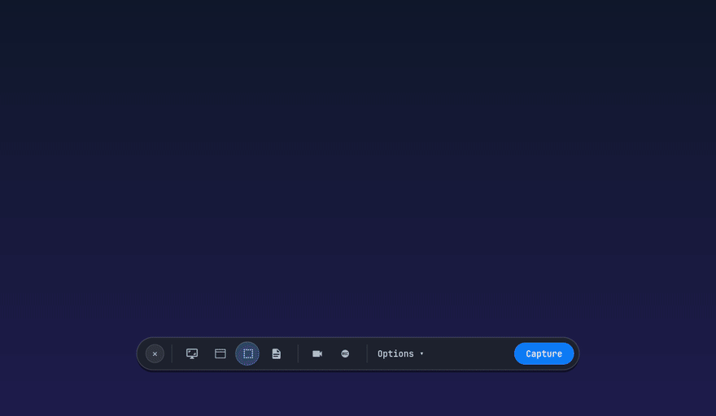
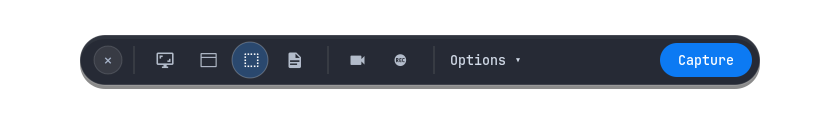

# shotdock

Wayland screenshot and screen recording tool with window framing and an optional floating dock.

Supports Hyprland, Sway, River, Niri, and other Wayland compositors.



---

## Features

- **Area & Window Snip**: Interactive region selection with window snapping (`slurp`).
- **Window Framing**: Rounded corners, Gaussian drop shadow, macOS-style titlebar, and gradient canvas backdrops.
- **Offline Framing**: Frame existing image files via `shotdock frame <file>`.
- **Screen Freeze**: Freeze screen content during area selection (`hyprpicker`).
- **Screen Recording**: 60 FPS H.264 video recording with monitor, window, or region selector (`wf-recorder`).
- **OCR Text Extraction**: Extract text from screen directly to Wayland clipboard (`tesseract`).
- **Optional Floating Dock**: GTK4 LayerShell toolbar for quick visual access.

---

## Showcase

| Canvas Background | Window Framing | Floating Dock |
|:---:|:---:|:---:|
|  |  |  |

---

## Installation

### Arch Linux (AUR)

```sh
yay -S shotdock
# or paru -S shotdock
```

### Pre-compiled Binary (Linux x86_64)

Download the standalone binary from the [latest GitHub Release](https://github.com/sirrryasir/shotdock/releases/latest):

```sh
tar -xzf shotdock-v0.1.4-x86_64-linux.tar.gz
sudo install -Dm755 shotdock /usr/local/bin/shotdock
```

### From Source

```sh
git clone https://github.com/sirrryasir/shotdock.git
cd shotdock
cargo build --release
sudo install -Dm755 target/release/shotdock /usr/local/bin/shotdock
```

---

## Dependencies

- `gtk4` & `gtk4-layer-shell`
- `grim` & `slurp`
- `imagemagick` (ImageMagick 7)
- `wl-clipboard`
- `libnotify` (`notify-send`)

### Optional Dependencies

- `hyprpicker`: Freeze screen animations during selection (`--freeze` / `-z`)
- `tesseract` & `tesseract-data-eng`: OCR text extraction (`-t`)
- `wf-recorder`: Video screen recording (`-r`, `--record-area`)
- `satty` / `swappy`: Image annotation editor (`-e`)
- `rofi`: Screen recording target menu

#### Arch Linux

```sh
sudo pacman -S gtk4 gtk4-layer-shell grim slurp imagemagick wl-clipboard libnotify hyprpicker tesseract tesseract-data-eng wf-recorder swappy rofi
```

#### Fedora

```sh
sudo dnf install gtk4-devel gtk4-layer-shell-devel grim slurp ImageMagick wl-clipboard libnotify tesseract wf-recorder swappy rofi
```

---

## Usage

### Commands

| Command | Description |
|:---|:---|
| `shotdock -a` | Snip region or click window |
| `shotdock -a --freeze` | Snip region with frozen screen |
| `shotdock -w` | Capture window/region with studio framing |
| `shotdock -f` | Capture focused monitor |
| `shotdock -p` | Capture all connected monitors |
| `shotdock -t` | Extract text to clipboard (OCR) |
| `shotdock -r` | Toggle screen recording (interactive selector) |
| `shotdock --record-area` | Start region recording directly |
| `shotdock frame <file>` | Frame an existing image |
| `shotdock` | Open floating dock |

### Flags

| Flag | Description |
|:---|:---|
| `-e`, `--edit` | Open capture in editor (`satty` or `swappy`) |
| `--no-edit` | Bypass editor |
| `--no-shadow` | Disable drop shadow in framed capture |
| `--no-titlebar` | Disable window titlebar in framed capture |
| `-z`, `--freeze` | Freeze screen during area selection |
| `-c`, `--clipboard` | Copy framed image to clipboard (`shotdock frame`) |
| `-o`, `--output <path>` | Specify output path (`shotdock frame`) |
| `--theme <name>` | Canvas theme preset (`shotdock frame`) |

### Framing Existing Images

```sh
# Basic framing
shotdock frame input.png -o framed.png

# Custom theme with clipboard output
shotdock frame screenshot.png -o card.png --theme Sunset -c

# Without titlebar
shotdock frame terminal.png --theme Breeze --no-titlebar -o output.png
```

---

## Keybindings

### Hyprland (`hyprland.conf`)

```ini
# Screenshots
bind = SUPER, P, exec, shotdock -a
bind = SUPER CTRL, P, exec, shotdock -a --freeze
bind = SUPER ALT, P, exec, shotdock -w
bind = , Print, exec, shotdock -p

# Utilities
bind = SUPER CTRL, T, exec, shotdock -t
bind = SUPER, R, exec, shotdock -r
bind = SUPER SHIFT, D, exec, shotdock

# Floating dock blur rules
layerrule = blur, shotdock
layerrule = ignorezero, shotdock
```

### Sway (`config`)

```ini
bindsym $mod+p exec shotdock -a
bindsym $mod+Ctrl+p exec shotdock -a --freeze
bindsym $mod+Alt+p exec shotdock -w
bindsym Print exec shotdock -p
bindsym $mod+Ctrl+t exec shotdock -t
bindsym $mod+r exec shotdock -r
bindsym $mod+Shift+d exec shotdock
```

### Niri (`config.kdl`)

```kdl
binds {
    Mod+P { spawn "shotdock" "-a"; }
    Mod+Ctrl+P { spawn "shotdock" "-a" "--freeze"; }
    Mod+Alt+P { spawn "shotdock" "-w"; }
    Print { spawn "shotdock" "-p"; }
    Mod+Ctrl+T { spawn "shotdock" "-t"; }
    Mod+R { spawn "shotdock" "-r"; }
    Mod+Shift+D { spawn "shotdock"; }
}
```

---

## Configuration

`~/.config/shotdock/config.json`:

```json
{
  "show_cursor": false,
  "freeze": false,
  "window_shadow": true,
  "macos_titlebar": true,
  "canvas_theme": "Transparent",
  "timer_seconds": 0,
  "save_to_disk": true,
  "copy_to_clipboard": true,
  "open_in_editor": false,
  "save_dir": "~/Pictures/Screenshots",
  "editor": null,
  "ocr_lang": "eng",
  "studio_quality": true,
  "record_fps": 60
}
```

### Canvas Themes

- `Transparent`: Clean alpha PNG with soft drop shadow.
- `FollowSystem`: Dynamic gradient matching current wallpaper palette (Wallbash).
- `RealWallpaper`: Screenshot centered over blurred desktop wallpaper.
- `Sunset`: Rose to Violet gradient (`#f43f5e` to `#8b5cf6`).
- `Candy`: Vibrant Violet gradient (`#ec4899` to `#a855f7`).
- `Breeze`: Cyan to Blue gradient (`#06b6d4` to `#3b82f6`).
- `Raindrop`: Ocean to Indigo gradient (`#3b82f6` to `#6366f1`).
- `Midnight`: Deep dark slate gradient (`#1e1b4b` to `#0f172a`).
- `Forest`: Emerald to Mint gradient (`#059669` to `#10b981`).
- `White` / `Black`: Minimalist solid backdrops.

---

## Roadmap

- [ ] PipeWire audio recording toggle (system audio & microphone)
- [ ] Aspect ratio canvas presets (16:9, 9:16 Shorts/Reels, 1:1, 4:3)
- [ ] Direct MP4 to optimized GIF (`gifski`) and WebM export
- [ ] Native Wayland screencopy protocol client (`zwlr_screencopy_v1`)

---

## Contributing

Contributions, bug reports, and suggestions are welcome!

```sh
# Verify formatting & clippy checks pass
cargo check
cargo clippy -- -D warnings
cargo fmt --check
cargo build --release
```

Feel free to open an issue or submit a pull request.

---

## License

[MIT](LICENSE)
