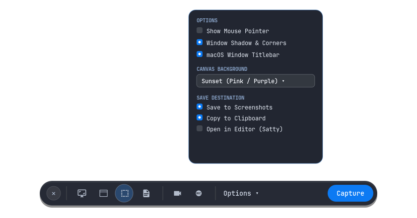

# Configuration Reference

The configuration file is located at `~/.config/shotdock/config.json`:

```json
{
  "show_cursor": false,
  "freeze": false,
  "window_shadow": true,
  "macos_titlebar": true,
  "canvas_theme": "Transparent",
  "timer_seconds": 0,
  "save_to_disk": true,
  "copy_to_clipboard": true,
  "open_in_editor": false,
  "save_dir": "~/Pictures/Screenshots",
  "editor": null,
  "ocr_lang": "eng",
  "studio_quality": true,
  "record_fps": 60
}
```



---

## Schema

- `show_cursor` (boolean): Include mouse cursor in screenshots. Default `false`.
- `freeze` (boolean): Freeze screen animations during snip via `hyprpicker`. Default `false`.
- `window_shadow` (boolean): Render 16px rounded corners and Gaussian drop shadow. Default `true`.
- `macos_titlebar` (boolean): Add dark mock titlebar with window controls. Default `true`.
- `canvas_theme` (string): Background canvas preset. Default `"Transparent"`.
- `timer_seconds` (number): Countdown delay in seconds before capture (0, 3, 5, 10). Default `0`.
- `save_to_disk` (boolean): Write screenshot PNG to `save_dir`. Default `true`.
- `copy_to_clipboard` (boolean): Copy screenshot PNG to Wayland clipboard. Default `true`.
- `open_in_editor` (boolean): Immediately launch annotation editor after capture. Default `false`.
- `save_dir` (string): Directory path for saved screenshots (supports `~/`).
- `editor` (string or null): Custom editor binary (e.g. `"satty"` or `"swappy"`). Default auto-detects `satty` then `swappy`.
- `ocr_lang` (string): Tesseract OCR language model code. Default `"eng"`.
- `studio_quality` (boolean): Enable 60 FPS visually lossless H.264 recording profile (CRF 18). Default `true`.
- `record_fps` (number): Target framerate for video recording. Default `60`.

---

## Canvas Themes

- `"Transparent"`: Alpha PNG with soft drop shadow.
- `"FollowSystem"`: Dynamic gradient matching desktop wallpaper palette (Wallbash).
- `"RealWallpaper"`: Screenshot centered over blurred desktop wallpaper.
- `"White"` / `"Black"`: Solid studio backdrops.
- `"Sunset"`: Pink to purple gradient (`#f43f5e` to `#8b5cf6`).
- `"Candy"`: Violet gradient (`#ec4899` to `#a855f7`).
- `"Breeze"`: Cyan to blue gradient (`#06b6d4` to `#3b82f6`).
- `"Raindrop"`: Blue to indigo gradient (`#3b82f6` to `#6366f1`).
- `"Midnight"`: Deep dark indigo gradient (`#1e1b4b` to `#0f172a`).
- `"Forest"`: Emerald to green gradient (`#059669` to `#10b981`).
