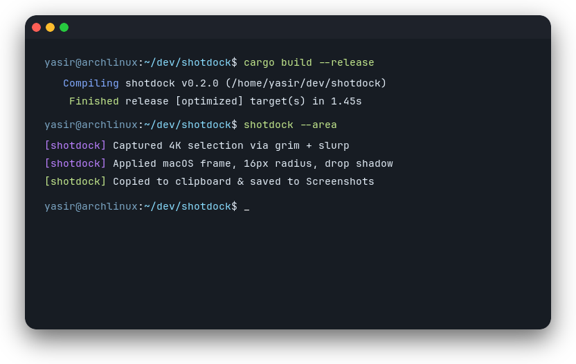

# Window Framing & Canvas Themes

`shotdock` provides a built-in aesthetic pipeline that transforms raw screenshots into presentation-ready cards.

---

## Window Framing

When `window_shadow` and `macos_titlebar` are enabled:

1. **Rounded Corners**: Precision 16px anti-aliased mask.
2. **Omnidirectional Shadow**: Multi-pass Gaussian drop shadow cast evenly on all four sides.
3. **Window Titlebar**: Dark mock titlebar with macOS-style window controls.



### Live Capture

Generate framed captures directly using the CLI:

```sh
# Full studio framing (titlebar + shadow + canvas)
shotdock -w

# Studio framing without shadow
shotdock -w --no-shadow

# Studio framing without mock titlebar
shotdock -w --no-titlebar
```

---

## Canvas Background Themes

Wrap any capture in an aesthetic backdrop:

| Theme | Description |
|---|---|
| `Transparent` | Clean alpha PNG with soft drop shadow |
| `Follow System (Wallbash)` | Auto-generated gradient matching active wallpaper palette |
| `Real Wallpaper (Blurred)` | Centers screenshot over blurred desktop wallpaper |
| `Sunset` | Pink to Purple gradient (`#f43f5e` to `#8b5cf6`) |
| `Candy` | Vibrant Violet gradient (`#ec4899` to `#a855f7`) |
| `Breeze` | Cyan to Blue gradient (`#06b6d4` to `#3b82f6`) |
| `Raindrop` | Ocean Indigo gradient (`#3b82f6` to `#6366f1`) |
| `Midnight` | Deep Indigo gradient (`#1e1b4b` to `#0f172a`) |
| `Forest` | Emerald gradient (`#059669` to `#10b981`) |
| `White` / `Black` | Minimalist solid studio backdrops |


---

## Headless Offline Image Framing

Frame existing image files directly from your terminal, shell scripts, or CI/CD pipelines without launching any GUI:

```bash
# Basic framing (macOS titlebar + 16px radius + shadow)
shotdock frame screenshot.png

# Frame with custom output file
shotdock frame terminal.png -o docs/terminal_framed.png

# Apply gradient canvas background (e.g. Sunset, Breeze, Candy, Midnight, Forest)
shotdock frame window.png --theme Sunset -o framed_card.png

# Copy framed output directly to Wayland clipboard
shotdock frame code.png -c

# Strip titlebar or shadow for custom layouts
shotdock frame app.png --no-titlebar --theme Breeze
```
