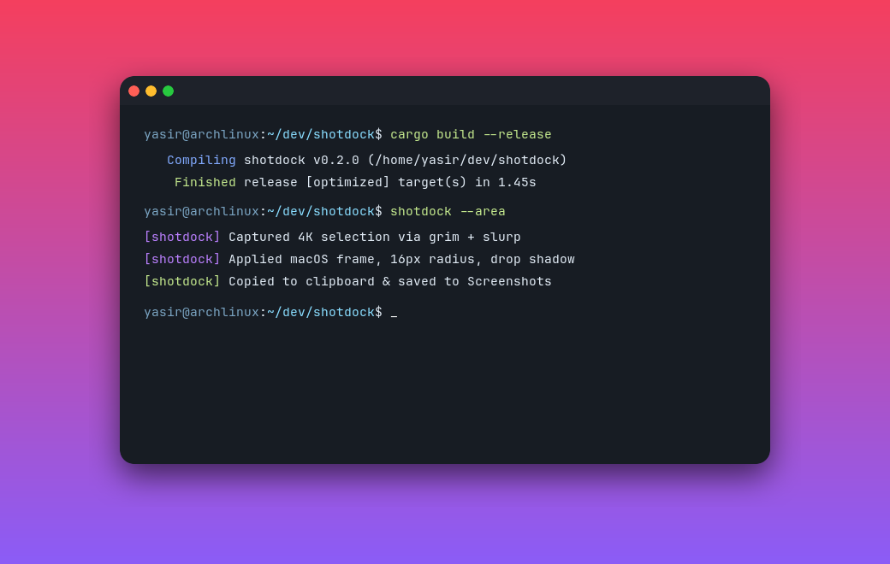

# shotdock

Modern floating screenshot and 4K screen recording dock for Wayland compositors (**Hyprland**, **Sway**, **Niri**, **Wayfire**).


`shotdock` provides an anchored floating pill dock, macOS window framing, soft drop shadows, 60 FPS studio recording, and presentation canvas themes.

---

## Showcase

| Floating Dock | Presentation Canvas |
|:---:|:---:|
|  |  |

---

## Key Highlights

- **Window Framing**: Automatic 16px rounded corners, omnidirectional Gaussian drop shadows, and dark mock window titlebars.
- **Presentation Canvas**: Wrap any window or region capture into aesthetic backgrounds:
  - `Transparent` (alpha PNG)
  - `Follow System (Wallbash)` (auto-matches your desktop color scheme)
  - `Real Wallpaper (Blurred)` (centers your capture over your blurred wallpaper)
  - `Gradients` (Sunset, Candy, Breeze, Raindrop, Midnight, Forest)
  - `Solid Studio` (Minimalist White and Black)
- **Interactive Floating Dock**: Responsive GTK4 LayerShell dock anchored to screen with backdrop blur.
- **Rich Notification Preview Cards**: Instant visual image thumbnail cards in notification center with `[ Annotate ]` and `[ Delete ]` actions.
- **Studio Screen Recording**: 60 FPS H.264/MP4 recording (CRF 18) with isolated PID tracking and one-click playback.
- **OCR Text Extraction**: Snip any text on screen to extract plain text directly to your Wayland clipboard via Tesseract.

---

## Quick Start

```sh
# On Arch Linux (AUR)
yay -S shotdock

# Launch the dock
shotdock
```
